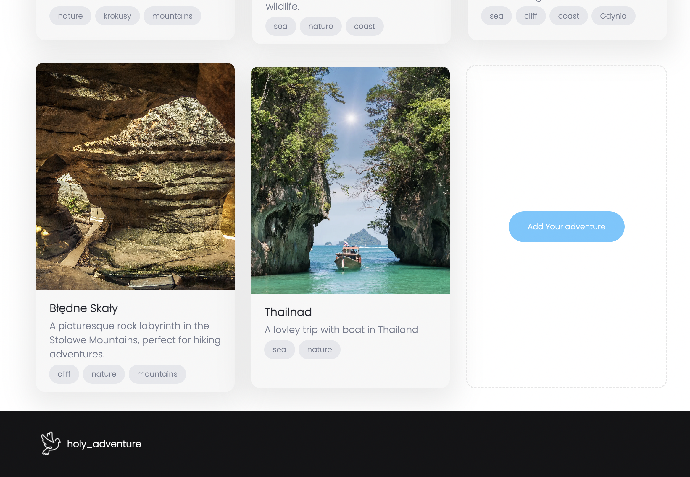
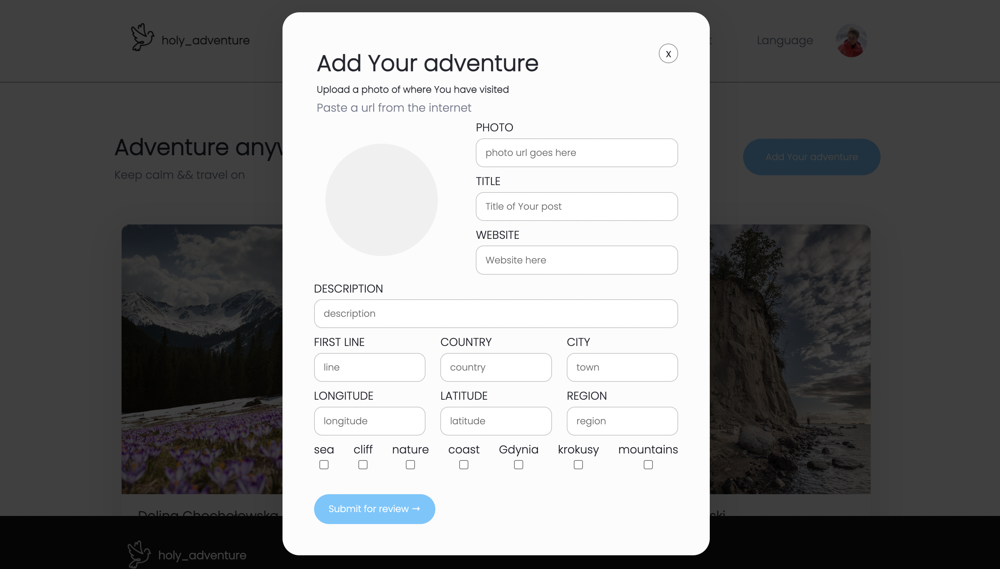

# 🎡 Travel App 🎡

## 🌍 About the project

By far my biggest project so far.

**Travel App** is a full-stack application that allows users to create, edit and delete travel posts, explore locations on an interactive map and discover details about places they’ve visited.

The app is built with **React** on the frontend and **Node.js / Express** on the backend.  
All posts are stored in **DataStax Astra DB (Document API)** and locations are visualized using **Mapbox**.

I’m genuinely proud of this project — it pushed me through many real-world frontend and backend challenges and helped me understand how full-stack applications actually work.

---

## 👀 First look

### 🏠 Home page
The main page displays all travel posts in a clean, card-based layout.

---

### ➕ Add a new adventure
You can add your own travel experience in two different ways — both open a modal where you can fill in all essential data.

---

### 📍 Post details
Clicking on a specific card opens a detailed view where you can:
- see the exact location on the map,
- visit the official website,
- edit or delete the post.

---

## 🛠️ Technologies used

- **React** (Classic React with Hooks)
- **React Router**
- **Node.js / Express.js**
- **DataStax Astra DB** (Document API)
- **Mapbox** (maps & geolocation)
- **Axios**
- **CSS**

---

## 🚀 Features

- Create, edit and delete travel posts
- Interactive map with location markers
- Modal-based UI for creating and editing posts
- Dynamic routing for individual post pages
- Full CRUD functionality
- Responsive and clean UI

---

## 💚 Acknowledgements

This project is part of an amazing **Full Stack Developer Course** created by  
💚 **Ania Kubow** 💚

I truly appreciate her teaching style, sense of humor and ability to explain complex topics in a clear and approachable way.  
Highly recommended 🏆

---

## 📌 Status

The project is still evolving and will be further improved with new features and refinements.
